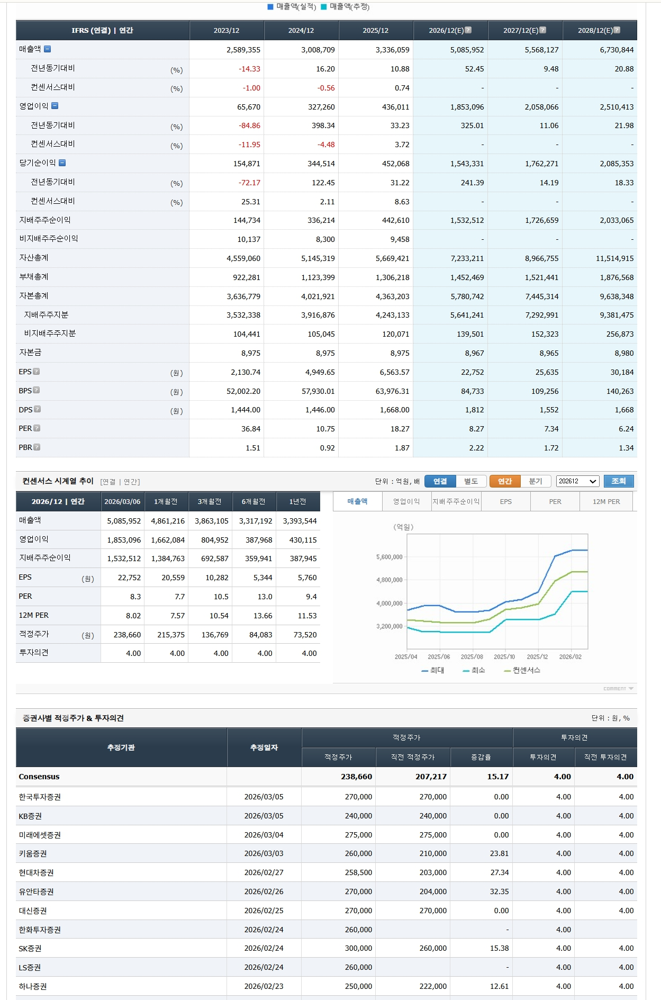
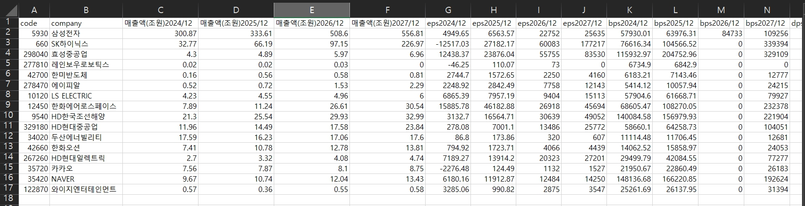
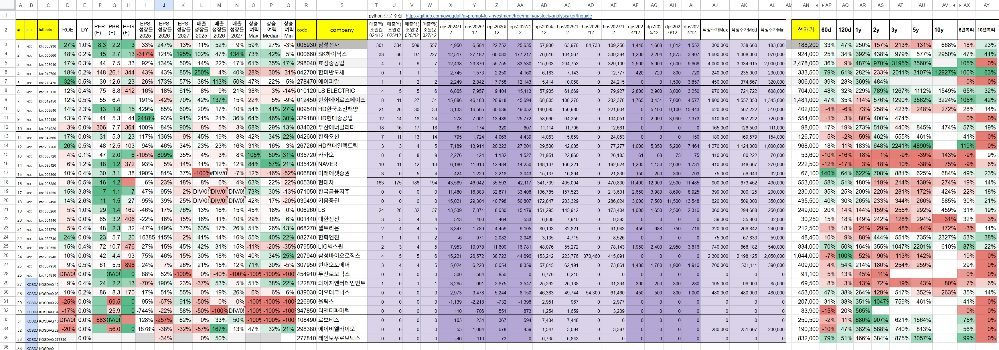

# FnGuide Financial Data Crawler

## 1. 개요

`crawl_fnguide.py`는 FnGuide 웹사이트에서 여러 국내 주식 종목의 재무 컨센서스 데이터를 자동으로 수집하여 CSV 파일로 저장하는 파이썬 스크립트입니다.

## 2. 주요 기능

- **다수 종목 데이터 수집**: 지정된 종목 코드 리스트에 대해 순차적으로 데이터를 수집합니다.
- **주요 재무 데이터 추출**:
  - 기업명, 종목 코드
  - 향후 4개년 실적 컨센서스 (매출액, EPS, BPS, DPS)
  - 증권사별 적정주가 (최고, 최저, 평균)
  - 베타 계수 (현재는 1.8로 고정)
- **CSV 파일 저장**: 수집된 모든 데이터를 하나의 CSV 파일로 취합하여 저장합니다.
  - 파일명 형식: `fnguide-{첫번째종목명}포함{총개수}개-{첫번째종목코드}-{수집일시}.csv`

## 3. 사전 준비 사항

스크립트 실행을 위해 아래 라이브러리들이 필요합니다. `pip`을 사용하여 설치해 주세요.

```bash
pip install selenium webdriver-manager beautifulsoup4
```

또한, 스크립트 실행 환경에 Chrome 브라우저가 설치되어 있어야 합니다.

## 4. 사용 방법

1.  **조회할 종목 코드 수정**:
    - `crawl_fnguide.py` 파일을 엽니다.
    - 파일 하단의 `if __name__ == "__main__":` 블록 안에 있는 `STOCK_CODES` 리스트를 찾습니다.
    - 원하는 종목의 코드를 추가하거나 수정합니다.

    ```python
    if __name__ == "__main__":
        STOCK_CODES = [
            "005930",  # 삼성전자
            "000660",  # SK하이닉스
            "035720",  # 카카오
            # ... 원하는 종목 코드를 여기에 추가 ...
        ]
    ```

2.  **스크립트 실행**:
    - 터미널 또는 명령 프롬프트를 엽니다.
    - `crawl_fnguide.py` 파일이 있는 디렉토리로 이동합니다.
    - 아래 명령어를 입력하여 스크립트를 실행합니다.

    ```bash
    python crawl_fnguide.py
    ```

3.  **결과 확인**:
    - 스크립트 실행이 완료되면, 동일한 디렉토리에 데이터가 저장된 `.csv` 파일을 확인할 수 있습니다.
    - 예시: `fnguide-삼성전자포함17개-005930-20240516-103000.csv`

## 5. screenshot

fnguide web site : https://comp.fnguide.com/SVO2/ASP/SVD_Consensus.asp?pGB=1&gicode=A005930&cID=&MenuYn=Y&ReportGB=&NewMenuID=108&stkGb=701



csv result



google spread example

